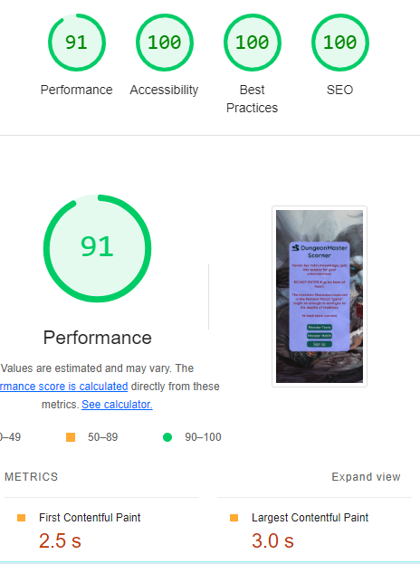

# DungeonMaster Scorner

DungeonMaster Scorner is a quiz website that will test the knowledge of dungeonmasters using Volo's Guide to Monsters. This will be for DnD 5th edition. There will be a Monster Facts page to test the users general knowledge on Monsters, a Monster Match page for matching monsters images to their names and a Signup page so users can create a login, and a Feedback page that will show after users fill in the sign up form.

## Features 
### Existing Features

- __The DungeonMaster Scorner Logo__

  - Featured at the top of the games and sign up page, the DungeonMaster Scorner logo and heading is easy to see for the user. Upon viewing the page, the user will be able to see the name of the website.

- __Home Page__

  - This is a page with links to both games, and the sign up page. This is a safe place for users to relax and choose what they would like to do.

- __The Game Area (Monster Facts)__

  - This Page hosts the first game, where users can test their general knowledge from Volo's Guide to Monsters. It has a home button to go back to the home page, and a restart quiz button to take the user back to the beginning of the quiz.  

- __The Game Area (Monster Match)__

  - This Page hosts the second game, where users can test their monster visuals knowledge from Volo's Guide to Monsters. It has a home button to go back to the home page, and a restart quiz button to take the user back to the beginning of the quiz. 

- __The Tally Area__

  - This section will allow the user to see exactly how many correct answers they have provided, and how many questions have been asked.

- __The Alert For End Of Quiz__

  - This alert aloows users to easily see that they have ended the quiz

## Testing 

- I would like to give a brief apology before you read any further, due to having 2 infections (chest and ear), I only had 2 days to finish the walkthrough project and complete this project, so it is certainly not everything it could be. I worked on it for 12 hours straight both days to get it finished, but I'm sure you can see that it is not as good as it could have been given more time and care.

- Logo: The logo was not responding to various screen sizes on the live version as well as it was on the test version of the website, so after a few attempts at pushing the new styles through to the live version, it now behaves as it should.

- Home Page: This is where most of the testing took place in terms of styling for the main box, as the rest of the pages just had it copied and pasted in once this was done. I tried this on dev tools, and got it to the point where it looked good on all different phone screens available. 
- However I later realised (quite some way through the project) that the screen was not scrolling and content was completely missed, so once that was fixed I started testing absolutely everything on landscape mode as well as portrait.
- I ensured the buttons all did as they should when clicked, which took a while for the buttons I used the onclick for, which needed to be made global. Google helped a lot during that process. 
- Once the pages that make up this page was complete, it was mainly copy and pasting and small alterations to the next pages.

- The Game Area (Monster Facts): This was a very challenging Javascript page, and again once I had completed this, the other game was quite easy in comparrison with a few tweaks and changes here and there. 
- The buttons took a long time to get working, but once I had them all working I tested them by clicking them all for the right answers, all wrong and a mix to make sure it always got to the end of the game.
- I tested the home buttons and restart quiz buttons both in the test page and on the live page, ensuring they always did as expected, no matter the device used on dev tools, the orientation of the device or if I double clicked. 

- The Game Area (Monster Match): This was a copy and paste from the last game, with a few tweaks. The images at first were not loading properyly, an donce I had solved that problem they were not centered. Once all of this was fixed, I tested them on all the available screen sizes, which all looked great until i exited dev tools for the full screen view when a the buttons started appearing beside the image, instead of below. I fixed that and it then looked great on all screen sizes. 

- The Tally Area: Once I had all the code running nicely and it was displaying what I needed it to, all that was left was the styling, which didn't take long due to having styling in place for other bits already. Again, as with all features I used Dev tools to compare the views on all screen sizes and orientations to ensure it was counting for all of them. 

- The alert window: I was having troubles with this not firing at the end of the quiz, i needed to remove an if else statement.

- Throughout this project I had available, and used quite a lof of tutor support, I cannot thank them enough.

### Validator Testing 

- HTML
    - No errors were returned when passing through the official [W3C validator](https://validator.w3.org/nu/?doc=https%3A%2F%2Fsarab333.github.io%2Fdungeonmaster-scorner%2F)
  
  

- CSS
    - No errors were found when passing through the official [(Jigsaw) validator](https://jigsaw.w3.org/css-validator/validator?uri=https%3A%2F%2Fsarab333.github.io%2Fdungeonmaster-scorner%2F&profile=css3svg&usermedium=all&warning=1&vextwarning=&lang=en)

- JavaScript
    - No errors were found when passing through the official [Jshint validator](https://jshint.com/)
      - The following metrics were returned: 
      - There are 21 functions in this file.
      - Function with the largest signature take 2 arguments, while the median is 0.
      - Largest function has 14 statements in it, while the median is 2.
      - The most complex function has a cyclomatic complexity value of 4 while the median is 1.
      - There were many warnings, as shown below:

- Lighthouse 
  - Performance graded by lighthouse as below image

## Deployment

- The site was deployed to GitHub pages. The steps to deploy are as follows: 
  - In the GitHub repository, navigate to the Settings tab 
  - From the source section drop-down menu, select the Master Branch
  - Once the master branch has been selected, the page will be automatically refreshed with a detailed ribbon display to indicate the successful deployment. 

The live link can be found here - https://sarab333.github.io/dungeonmaster-scorner/

## Credits 
### Content 

- Asterisk wildcard selector in css copied from love running project
- Monster Facts taken from Volo's Guide to Monsters (a book I own)
a lot of the code structure in the javascript elements taken from [Medium](https://medium.com/@codepicker57/building-an-interactive-quiz-with-html-css-and-javascript-efe9bd8129e2) and then adapted from there. code copied includes all code on this page apart from the css element.
- sign up form copied from [code institute lesson](https://learn.codeinstitute.net/courses/course-v1:CodeInstitute+LMR101+1/courseware/0a4bf408d10c4149bb686457ac11edf6/16d62f1111064f5cb6a64582da96a41b/) (please see below code that was copied and altered for this project)
- ><body>
  >    <h3>Register your account:</h3>
  >  

  >  <form id="registration-form" method="POST" action="https://formdump.codeinstitute.net/">
  >      

  >          <label for="username">Username:</label>
  >          <input id="username" name="username" type="text" required>
  >      

  >      

  >          <label for="password">Password:</label>
  >          <input id="password" name="password" type="password" required>
  >      

  >      <input type="submit">
  >      
  >  </form>
  >  
  >  
  ></body>
  >let usernames = ["Harry", "Daisy", "Michael", "Sarah", "Sally"];

  >// Write your code here
  >let form = document.getElementById('registration-form');
  >form.addEventListener('submit', handleSubmit);
  >let errorMsg = document.getElementById('errors');
  >function handleSubmit(event) {
  >  event.preventDefault;
  >  let usernameInput = document.getElementById('username').value;
  >  if (usernames.includes(usernameInput)) {
  >      errorMsg.innerHTML = `Sorry, the username ${usernameInput} is already in use. Please choose another username.`;
  >  } else {
  >      usernames.push(usernameInput);
  >      form.submit();
  >      console.log(usernames);
  >  }
  >}

### Media

- favicon taken from [icons8](https://icons8.com/icon/104704/dungeons-and-dragons)
- background image taken from [Forgotten Realms](https://forgottenrealms.fandom.com/wiki/Volo%27s_Guide_to_Monsters_(in-universe))
- all images for Monster match game taken from [Forgotten Realms](https://forgottenrealms.fandom.com/wiki/Main_Page)